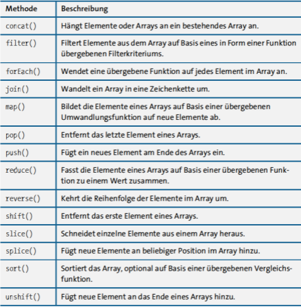
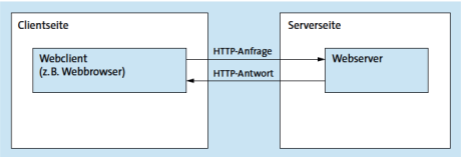

# Mitschrift Formulare

## 1

Validierung sehr wichtig, benutzt für responsive bootstrap
1. Formular erstellen
2. Eingabefelder definieren
3. Clientside validation
4. Serverside validation
5. Datenverarbeitung
6. Ausgabe

Formular mittles Bootstrap erstellt, siehe Bootstrap dokumentation. \
Eigenschaften des Forms (clientside validation) mit verschidenen html tags in dem Form

Javascript validierung des Datums mittels der ``validateExamDate`` methode mittels der Bootstrap klassen : is-valid und is-invalid

Methoden: GET ist wenn man die Seite lädt, POST is wenn man an den Server schickt (form).

Value benutzen, mit php: damit der User immer noch die Daten nach dem Abschicken sehen kann

Serverseitige validierung mittels php func.inc.php (bool methode validate) kontrolliert sinnvolle Werte in diesem POST

Errors werden in ein assoziativen Array gespeichert, diese werden dann auch ausgegeben im Fall eines Umgehen der clientside validierung (mit den einzelnen Methoden für die Felder werden die Fehler in das $errors array geladen und dann ausgegeben).

Testen der Anwendung:
mittels Netzwerkanalyse und manipulieren (im browser) der clientside validierung

## Theorie

### Kapitel 4
JS einbinden, entweder inline (html durch \<script>), in einem externen File(Lokal/Einbindung durch eine cdn)

dialog mit alert(mitgabe);
console.log() / .debug() / .error() / .info() / .warn()

let, const, var usw. weiß ich alles schon

... JS kann ich schon

try catch ganz normal wie in java oder php

js objekt ohne Klassen definition:
{
    title: 'Hello World',
    age: 23,
    ...
}

Objekte und Arrays kann ich genau so, nur Methoden sind neu:

#### Array methoden:

### Kapitel 5.1
HTTP ist Client-Server modell\

## 2

## 3