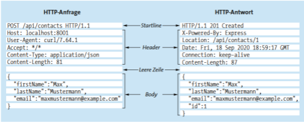
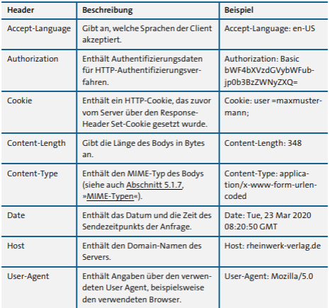
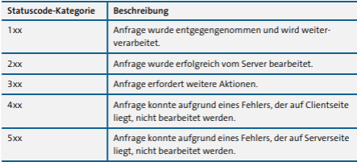
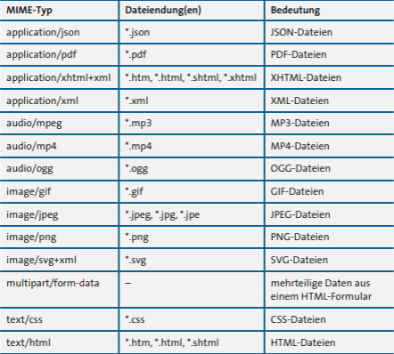
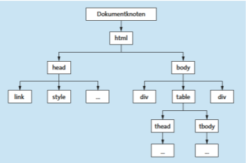
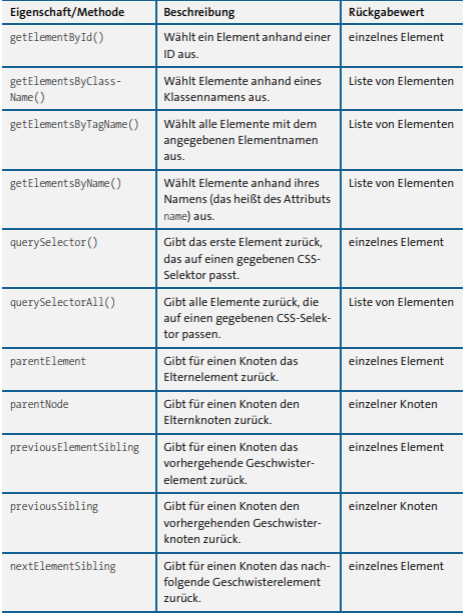

# Mitschrift Formulare

## 1

Validierung sehr wichtig, benutzt für responsive bootstrap
1. Formular erstellen
2. Eingabefelder definieren
3. Clientside validation
4. Serverside validation
5. Datenverarbeitung
6. Ausgabe

Formular mittles Bootstrap erstellt, siehe Bootstrap dokumentation. \
Eigenschaften des Forms (clientside validation) mit verschidenen html tags in dem Form

Javascript validierung des Datums mittels der ``validateExamDate`` methode mittels der Bootstrap klassen : is-valid und is-invalid

Methoden: GET ist wenn man die Seite lädt, POST is wenn man an den Server schickt (form).

Value benutzen, mit php: damit der User immer noch die Daten nach dem Abschicken sehen kann

Serverseitige validierung mittels php func.inc.php (bool methode validate) kontrolliert sinnvolle Werte in diesem POST

Errors werden in ein assoziativen Array gespeichert, diese werden dann auch ausgegeben im Fall eines Umgehen der clientside validierung (mit den einzelnen Methoden für die Felder werden die Fehler in das $errors array geladen und dann ausgegeben).

Testen der Anwendung:
mittels Netzwerkanalyse und manipulieren (im browser) der clientside validierung

Requests und Responses in HTTP sehen so aus:

dabei gibt es verschiedene HTTP methoden:
- GET
- POST
- PUT
- PATCH
- DELETE
- CONNECT
- TRACE
- HEAD
- OPTIONS

am häufigsten werden GET (holen von Daten) und POST (senden von Daten) verwendet.

dazu gibt es auch noch header : ein Authentication Header, ob man bei dieser HTTP response berechtigt ist, Content-Type (zb. application/json (siehe MIME))...
Einige Header aufgelistet:

Der Body beihnaltet dann immer das, was man mitschickt, oder geschickt bekommt. (siehe in der Abbildung in Json-Format)

In der Abbildung sieht man auch den Status-Code der Response: 201 Created / 200 OK sind z.B. Erfolg. 400 Bad Request / 401 Unauthorized / 403 Forbidden / 404 Not Found sind z.B. Failure Codes

#### MIME

Multipurpose Internet Mail Extenstion Types, definieren welches Format die übertragenen Daten haben.

...

#### Cookies

Clientseitiges speichern von kleinen Datensätzen, welche bei erneutem Besuch einer Seite vom Server ausgelesen werden können. Cookies haben immer diese Eigenschaften: Name und Wert, Ablaufdatum (z.B. Session Alaufdatum), Domäne des Servers, Sicherheitsflag bei SSL.

HTTP kann auch durch curl (cli oder library in einer Programmiersprache) geregelt werden.

### Kapitel 7

DOM ist das Document Object Model, Browser parsed das HTML in DOM um.
Der DOM modelliert alle HTML Elemente und Attribute usw. in das DOM hierarchisch in eine Baumstruktur um:

der Dokumentknoten dient als Wurzel aller Elemente einer HTML-Seite. Es gibt insgesamt vier wichtige Knoten im DOM: Dokumentknoten(wurzelknoten), Elementknoten(head, body usw), Attributknoten(id, value usw), Textknoten(plaintext)

Knoten-selektierung mittels Javascript:

HTML-Elemente können mittels Javascript mit verschiedenen Methoden und Eigenschaften manipuliert werden: innerHTML(), createTextNode(node), appendChild(), classList(), textContent(), createElement(), removeChild(), createElement(elementName), attribute setzen usw. 

#### API

eine API (Application Programming Interface) ist eine Schnittstelle, die es programmierern erlaubt, verschiedene Ressourcen zu verwenden oder zu manipulieren (nehme man REST API) eine REST (Representational State Transfer) API ist dafür da, um mittels einem HTTP request daten zu übermitteln, oder diese übermittel zu kriegen. Siehe man Firestore (von Firebase): man schickt bei der REST api einen bestimmten pfad mit (im link), um eine json response mit allen Daten zu bekommen (GET). Dabei kann man auch einen Token im Header mitgeben, um Authentication sicherzustellen. (Authentication: Bearer TOKEN). Gleich geht es aber auch mit einer POST, PATCH oder PUT request, diese lädt das von dem Body der HTTP request auf die Datenbank mit dem angegeben Pfad hoch (gleicher Aufbau wie mit dem GET request).

## 2

## 3